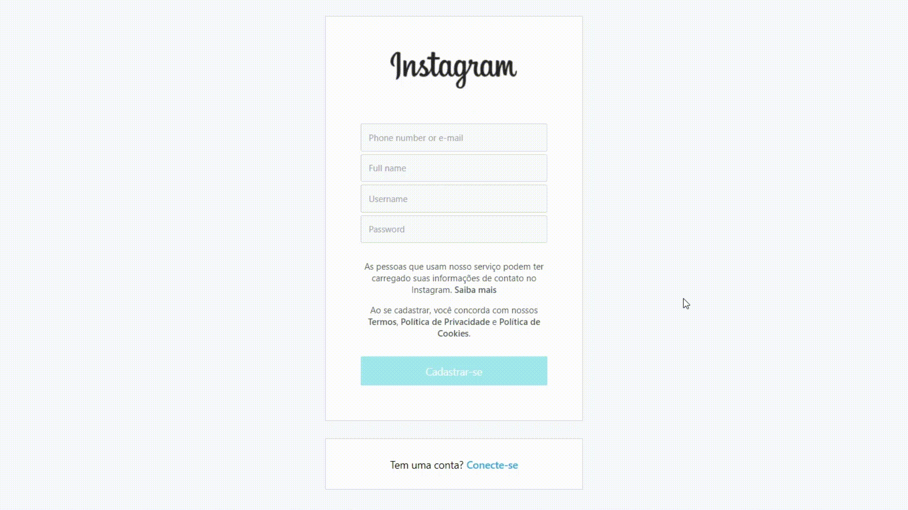
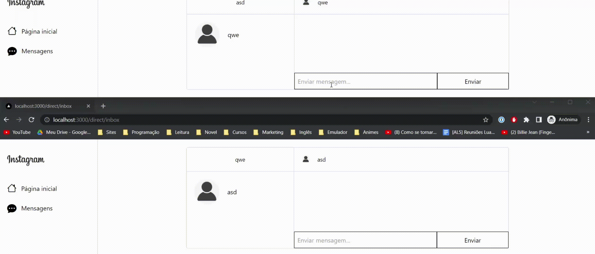

## Clone do Instagram criada com Next.js como front-end e Node.js como backend

&nbsp;

Iniciar backend:

* Entre na pasta backend;
* Digite no terminal 👇
    
```bash
nodemon app
# or
node app
```
&nbsp;

Iniciar backend:

* Entre na pasta frontend;
* Digite no terminal 👇
    
```bash
yarn start
# or
npm start
```

&nbsp;

Na aplicação existem as seguintes ferramentas: 

# Login e Signup

* Sistema de login e signup;
    * Verificando se o e-mail ou telefone é válido e já não existe no banco de dados;
    * Verifica se o username é válido e já não existem no banco de dados.
&nbsp;

&nbsp;

# Post

* É possível postar conteúdo.

    &nbsp;
    
    &nbsp;

# Chat

* Vamos conversar? Também recriei o modo de chat do instagram, onde salvo as mensagens no banco de dados para que apareça em conversas futuras.
    * No quando entrar na área do inbox, não vai ter ninguém, por que ali aparece as pessoas que criaram a conta na aplicação, então abra uma guia anonima, crie sua conta e entre no inbox que já vai ter uma pessoa para fazer o teste

    &nbsp;
    
    &nbsp;

OBS: Não fiz o template responsivo por questão de tempo, como o projeto não vai pra produção não acho que precise fazer isso, é mais como uma demonstração mesmo.